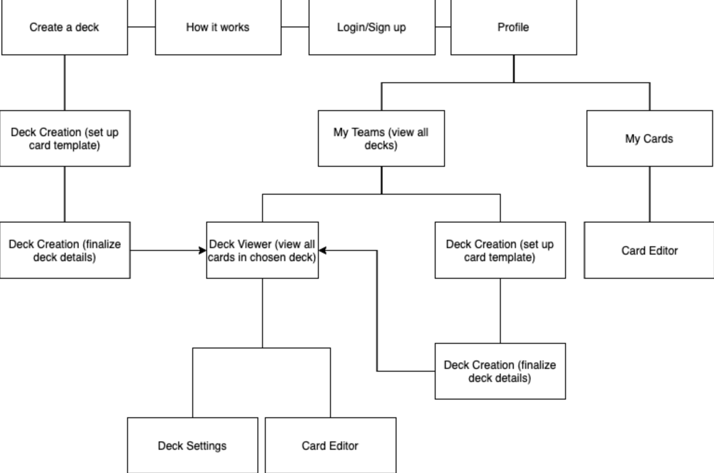

## User Experience Design

### Prototype
View our prototype, detailing pages and functions of the app in a visualized manor.

[Prototype](https://projects.invisionapp.com/share/5J11VJM29DYF#/screens)

### App Map

### Wireframes
#### Login and Signup Screens

#### Hamburger Menu
\
This is the main side menu for navigating the app.
#### Instructions Page
\
This page shows users the main functions of the app.
#### Creating Decks and Cards

\
Screens for creating new cards and decks, as well as saving them if you have an account.
#### Deck Views

#### Update Decks and Cards

\
Update existing decks and cards.

#### View Your Profile

\
View your cards and teams.
